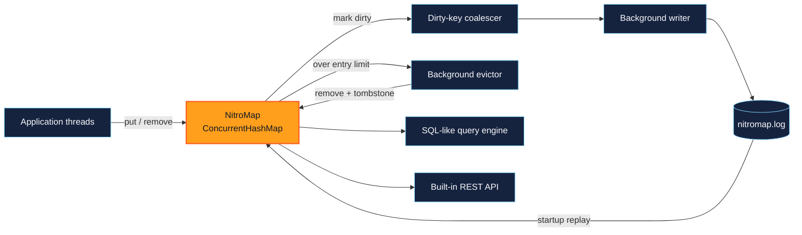
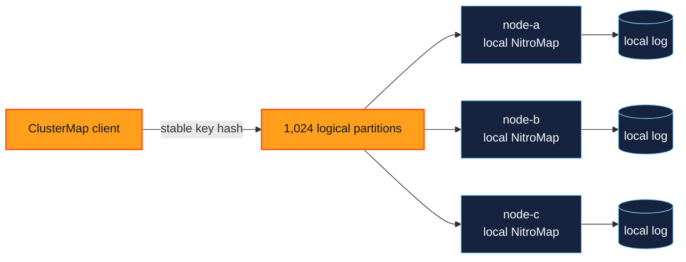

<p align="center">
  
</p>

<p align="center">
  
  
  
  
  
</p>

<p align="center">
  <a href="#quick-start">Quick start</a> &bull;
  <a href="#why-nitromap">Why NitroMap</a> &bull;
  <a href="#sql-like-queries">SQL</a> &bull;
  <a href="#shared-nothing-clustering">Clustering</a> &bull;
  <a href="#rest-api">REST API</a> &bull;
  <a href="#performance-benchmarks">Benchmarks</a>
</p>

---

NitroMap is an embedded Java record store built around the API developers already
know: `ConcurrentHashMap`. Reads stay in memory, mutations are persisted by a
background writer, named maps can be queried with a practical SQL subset, and
the same maps can be exposed or sharded through Java's built-in networking.

It is designed for applications that need fast local state without introducing
a database server, ORM, HTTP framework, or runtime dependency graph. The core
remains intentionally small, explicit, and understandable.

## Quick start

Add NitroMap to your application's `pom.xml`. It is available from Maven
Central, so no additional repository configuration is required:

```xml
<dependency>
    <groupId>io.github.kirstenali</groupId>
    <artifactId>nitromap</artifactId>
    <version>0.2.0</version>
</dependency>
```

Use the `dev.nitromap` package when importing NitroMap classes in Java code.

Create a persistent UTF-8 string map in one line:

```java
import dev.nitromap.NitroMap;

import java.util.Map;

NitroMap<String, String> customers = NitroMap.strings("data/customers");

customers.put("customer-1", "Ada");
customers.putAll(Map.of("customer-2", "Grace", "customer-3", "Linus"));
customers.remove("customer-3");
```

The factory creates the directory, restores existing records, starts background
persistence, and reports startup failures as `UncheckedIOException`. Keep the
map as an application-wide field when it should share the application's
lifecycle:

```java
private static final NitroMap<String, String> CUSTOMERS =
        NitroMap.strings("data/customers");
```

Factory-created maps share one JVM shutdown hook that performs a best-effort
final close during ordinary shutdown. `flush()` remains available for an
explicit durability checkpoint. Calling `close()` flushes immediately, releases
the file, and unregisters the map from the hook; use try-with-resources for
short-lived maps. Shutdown hooks cannot protect against `SIGKILL`, JVM crashes,
or power loss. The checked `Path` and codec constructor remains available when
an application wants to handle startup I/O failures directly.

**Current status:** early-stage, fully test-driven, Java 17 compatible, and best
suited to embedded applications that benefit from fast in-memory access and
asynchronous persistence.

## Table of contents

- [Quick start](#quick-start)
- [Why NitroMap](#why-nitromap)
  - [Highlights](#highlights)
- [Architecture](#architecture)
- [How persistence works](#how-persistence-works)
- [Log compaction](#log-compaction)
- [Codecs](#codecs)
- [SQL-like queries](#sql-like-queries)
  - [Supported query subset](#supported-query-subset)
  - [Aggregate behavior](#aggregate-behavior)
  - [Query optimization](#query-optimization)
- [Shared-nothing clustering](#shared-nothing-clustering)
  - [Key routing](#key-routing)
  - [Distributed query execution](#distributed-query-execution)
  - [Failure and topology changes](#failure-and-topology-changes)
- [Memory-bounded eviction](#memory-bounded-eviction)
- [REST API](#rest-api)
  - [Endpoints](#endpoints)
- [Where NitroMap fits](#where-nitromap-fits)
- [Performance benchmarks](#performance-benchmarks)
  - [Reference run](#reference-run)
- [Design principles](#design-principles)
  - [Keep the write path short](#keep-the-write-path-short)
  - [Prefer sequential I/O](#prefer-sequential-io)
  - [Persist state, not every intermediate event](#persist-state-not-every-intermediate-event)
  - [Make serialization explicit](#make-serialization-explicit)
  - [Keep storage and querying separate](#keep-storage-and-querying-separate)
  - [Be honest about consistency](#be-honest-about-consistency)
- [Scope and current boundaries](#scope-and-current-boundaries)
- [Building and testing](#building-and-testing)
- [Project layout](#project-layout)
- [License](#license)

## Why NitroMap

NitroMap combines three useful surfaces without hiding how any of them work:

| Surface | What it provides |
|---|---|
| Concurrent map | Familiar, thread-safe reads and writes on the in-memory hot path. |
| Persistent record store | Asynchronous batching, change coalescing, recovery, tombstones, and atomic compaction. |
| Queryable service | SQL-like selection, filtering, joins, grouping, aggregation, ordering, limits, and named parameters, plus local and distributed execution. |
| Shared-nothing cache | Stable logical partitions, zero-replication HTTP routing, streamed binary rows, bounded shuffles, and explicit topology changes. |

### Highlights

- Extends `ConcurrentHashMap` instead of replacing it with a proprietary API.
- Opens persistent UTF-8 string maps with `NitroMap.strings("data/customers")`.
- Persists `put`, `putAll`, both `remove` variants, and `removeAll` asynchronously.
- Offers opt-in destructive background eviction for entry-bounded maps.
- Keeps serialization and file I/O away from application write threads.
- Gives factory-created maps one shared JVM shutdown safety net.
- Replays a length-prefixed append-only log and safely discards a torn final record.
- Atomically compacts historical records into the current map state.
- Uses explicit application codecs rather than Java object serialization.
- Supports selection, joins, filtering, grouping, ordering, limits, and named parameters.
- Routes keys across any configured number of nodes without replicas or fallback reads.
- Executes distributed scans, hash shuffles, joins, aggregation, ordering, and limits with bounded memory.
- Serves one or many named maps through built-in Java networking.
- Provides authorization and native HTTP filter hooks without an external web framework.
- Has no runtime dependencies beyond the JDK.
- Is verified by 226 correctness and integration tests plus six opt-in benchmark tests.

## Architecture



## How persistence works

A persistent mutation follows a short path:

1. The in-memory `ConcurrentHashMap` is updated.
2. The changed key is marked in a concurrent dirty map.
3. A single background writer collects dirty keys every few milliseconds.
4. It reads each key's current state and appends the batch to `nitromap.log`.
5. The log is forced to disk once for the batch.

Changing the same key several times before the writer sees it replaces the
pending marker instead of creating several disk writes. Serialization and file
I/O never run inside `put` or `remove`.

Values use length-prefixed key and value bytes. Removals use `-1` as a compact
tombstone marker:

```text
put:    [key length][key bytes][value length][value bytes]
remove: [key length][key bytes][-1]
```

On startup, NitroMap replays complete entries in order. If the process stopped in
the middle of the final entry, that incomplete tail is discarded before new
records are appended.

## Log compaction

The append-only design favors write speed, but old values and tombstones make
the log grow. `compact()` replaces that history with one value record for every
entry currently in the map:

```java
customers.compact();
```

Compaction writes the current state to `nitromap.log.compacting`, forces the new
file to disk, and atomically replaces `nitromap.log`. Until the atomic move, the
old log remains untouched. A process interruption therefore leaves either the
old complete log or the new complete log as the active file.

The background disk writer pauses during replacement, but `put` and `remove`
continue updating memory and marking keys dirty. Changes racing with the
snapshot are appended after compaction, so they are not lost.

Compaction is synchronous and manually triggered in this version. It is best
run when log growth justifies the temporary disk and serialization work, not on
every write.

## Codecs

Persistence works with bytes rather than assuming how application objects
should be serialized. A codec supplies both directions:

```java
public interface Codec<T> {
    byte[] encode(T value) throws IOException;
    T decode(byte[] bytes) throws IOException;
}
```

The project includes `Utf8StringCodec`. Applications can implement codecs for
records, JSON, Protocol Buffers, or any stable binary format. Key encoding must
remain deterministic: the same logical key should always produce the same
meaning when the log is replayed.

For example, an application that uses Jackson can store a `Customer` as JSON:

```java
import com.fasterxml.jackson.databind.ObjectMapper;

record Customer(String name, String city, int score) {}

final class CustomerJsonCodec implements Codec<Customer> {

    private final ObjectMapper json = new ObjectMapper();

    @Override
    public byte[] encode(Customer customer) throws IOException {
        return json.writeValueAsBytes(customer);
    }

    @Override
    public Customer decode(byte[] bytes) throws IOException {
        return json.readValue(bytes, Customer.class);
    }
}
```

Supply the string key codec and JSON value codec when the map is created:

```java
NitroMap<String, Customer> customers = NitroMap.open(
        "data/customers",
        Utf8StringCodec.INSTANCE,
        new CustomerJsonCodec());

customers.put("customer-1", new Customer("Ada", "London", 100));
```

Jackson is supplied by the application in this example. NitroMap itself keeps
zero runtime dependencies and does not require a particular JSON library.

## SQL-like queries

The query engine operates entirely on the in-memory maps. It does not scan the
persistence log.

First, register maps as named tables and describe their visible columns:

```java
record Customer(String name, String city, int score) {}

Schema<Customer> customerSchema = Schema.<Customer>builder()
        .column("name", Customer::name)
        .column("city", Customer::city)
        .column("score", Customer::score)
        .build();

Catalog catalog = new Catalog()
        .add("customers", customers, customerSchema);

QueryEngine queries = new QueryEngine(catalog);
```

Schemas use explicit functions rather than reflecting over every value during a
query. The map key is automatically available through the special `_key`
column.

```java
QueryResult result = queries.query("""
        SELECT c.city, COUNT(*) AS customers,
               SUM(c.score) AS total_score,
               AVG(c.score) AS average_score
        FROM customers c
        WHERE c.city = :city OR c.name = :name
        GROUP BY c.city
        ORDER BY average_score DESC
        LIMIT 10
        """, Map.of("city", "London", "name", "Ada"));

for (Map<String, Object> row : result.rows()) {
    System.out.println(row);
}
```

### Supported query subset

The current parser supports:

- `SELECT` with columns, aliases, `*`, `COUNT(*)`, `COUNT(column)`, `SUM`,
  `AVG`, `MIN`, and `MAX`.
- `FROM` with optional table aliases.
- One or more `INNER JOIN` clauses using column equality.
- `WHERE` with `=`, `!=`, `<>`, `>`, `>=`, `<`, and `<=`.
- `AND`, `OR`, and parenthesized conditions. `AND` has higher precedence.
- Strings, numbers, booleans, `NULL`, and named parameters such as `:minimum`.
- `GROUP BY` over one or more columns.
- `ORDER BY` with multiple `ASC` or `DESC` columns.
- `LIMIT`, including `LIMIT 0`.

A join against the newly joined table's `_key` performs direct map lookups.
Other equality joins use a configured secondary index when available, otherwise
they build a temporary hash index. NitroMap never uses a nested loop join.

Parsed queries are cached by SQL text, so repeated parameterized queries do not
need to be parsed again.

### Aggregate behavior

`COUNT(*)` counts rows, while `COUNT(column)` counts non-`NULL` values. `SUM`,
`AVG`, `MIN`, and `MAX` also ignore `NULL`. An empty input returns `0` for both
forms of `COUNT` and `NULL` for the other functions.

`SUM` and `AVG` accept Java's primitive numeric wrapper types. Integral sums
return a `Long`; a sum containing `Float` or `Double` values returns a `Double`.
`AVG` always returns a `Double`. `MIN` and `MAX` return the selected scalar value.
Aliases are recommended when selecting the same function more than once.

### Query optimization

Simple equality predicates on a non-numeric `_key` use the map's direct lookup
path instead of scanning its entries. The remaining predicate is still checked
before projection. Numeric keys retain the scan path because SQL numeric
equality spans Java number types:

```sql
SELECT c.name FROM customers c
WHERE c._key = :customerId AND c.active = true
```

On that same simple-query path, `LIMIT 0` reads no rows. A positive `LIMIT`
stops execution early when a query has no join, grouping, aggregation, or
ordering that requires the complete input. Queries with
`ORDER BY`, `GROUP BY`, aggregates, or joins retain the full execution path so
their results remain correct.

Secondary indexes are optional and are declared after their table:

```java
Catalog catalog = new Catalog()
        .add("customers", customers, customerSchema)
        .add("orders", orders, orderSchema)
        .index("customers", "city")
        .index("orders", "customerId");
```

An index accelerates equality filters on its base table and equality joins when
the indexed column belongs to the joined table. It supports duplicate, numeric,
and `NULL` values. Indexes require `NitroMap` data and stay current after
`put`, `putAll`, both supported `remove` variants, and `removeAll`.

Indexes are deliberately opt-in. Building one scans the map once, stores a
key-to-value entry plus a bucket membership for each row, and adds work to
supported mutations. Maps without an index keep the normal write path apart
from one inactive-listener check.

## Shared-nothing clustering

NitroMap can shard a named map across any fixed set of processes. Each key has
one owner, each owner keeps using an ordinary local `NitroMap`, and there is no
replica, quorum, fallback read, or hidden copy. Local asynchronous persistence,
eviction, indexing, and recovery continue to work exactly as they do in the
embedded API.



### Key routing

Configure the nodes and choose a logical partition count independently of the
number of processes:

```java
import dev.nitromap.cluster.ClusterMap;
import dev.nitromap.cluster.ClusterNode;
import dev.nitromap.cluster.ClusterTopology;
import dev.nitromap.cluster.HttpClusterTransport;
import dev.nitromap.codec.Utf8StringCodec;

import java.net.URI;
import java.net.http.HttpClient;
import java.util.List;
import java.util.Map;

var nodes = List.of(
        new ClusterNode("node-a", URI.create("http://10.0.0.11:8080")),
        new ClusterNode("node-b", URI.create("http://10.0.0.12:8080")),
        new ClusterNode("node-c", URI.create("http://10.0.0.13:8080")));

var topology = ClusterTopology.evenly(1_024, nodes);
var transport = new HttpClusterTransport<>(HttpClient.newHttpClient(),
        Utf8StringCodec.INSTANCE,
        Utf8StringCodec.INSTANCE,
        Map.of("X-Api-Key", "secret"));

var customers = new ClusterMap<>(
        "customers", Utf8StringCodec.INSTANCE, topology, transport);

customers.put("customer-1", "Ada");
String customer = customers.get("customer-1");
```

The key codec bytes are hashed with stable FNV-1a, then mapped to a logical
partition and its configured owner. Routing therefore does not depend on a
JVM-specific object hash. `putAll` and `removeAll` group keys by owner and send
at most one binary request to each affected node.

`ClusterMap` keeps the familiar `get`, `put`, `remove`, `putAll`, and
`removeAll` surface but does not implement `Map`: returning the previous value
from a remote `put` would require another network read on the write path.

The example uses three nodes, but the implementation does not assume three or
four. All clients must use the same partition count and ownership table.
`ClusterTopology.assigned(...)` restores an exact assignment from application
configuration.

### Distributed query execution

Every data node exposes the same local catalog through its server. A coordinator
can then query local catalogs, remote nodes, or a mixture of both:

```java
import dev.nitromap.query.DistributedQueryEngine;

import java.net.URI;
import java.nio.file.Path;

var queries = DistributedQueryEngine.builder()
        .node("node-a", URI.create("http://10.0.0.11:8080"))
        .node("node-b", URI.create("http://10.0.0.12:8080"))
        .node("node-c", URI.create("http://10.0.0.13:8080"))
        .header("X-Api-Key", "secret")
        .shufflePartitions(128)
        .maxRowsInMemory(10_000)
        .spillDirectory(Path.of("data/query-spill"))
        .build();

try (var result = queries.query("""
        SELECT c.city, COUNT(*) AS total
        FROM customers c
        GROUP BY c.city
        ORDER BY total DESC
        LIMIT 20
        """)) {
    result.stream().forEach(System.out::println);
}
```

Every node catalog must declare every distributed table, using an empty local
map when that node currently owns no rows for a table. The server enables the
data-plane routes through `.clusterQueries(localQueryEngine)`.

The execution path is intentionally bounded:

- Scan/filter/projection queries run on each source node and stream binary rows.
- Grouping builds mergeable partial aggregate states, hashes group keys into
  shuffle partitions, externally sorts partials when needed, then combines them.
- Equality joins hash both sides with numeric-aware keys. A small side uses an
  in-memory hash table; oversized or skewed buckets use bounded blocks and spill.
- Ordered limits keep a bounded top-K heap when K fits the memory allowance.
  Larger sorts use sorted spill runs and a bounded global merge.
- Operators pull remote rows incrementally. Bounded stores spill instead of
  growing the heap, and `DistributedQueryResult` must be closed so temporary
  files can be removed.

The binary distributed row format supports `NULL`, strings, booleans, primitive
numeric values, characters, and byte arrays. Application records remain local;
schemas turn their queryable columns into these scalar values before transport.

The current shuffle and final merge are coordinated by the process running
`DistributedQueryEngine`. Its heap stays bounded and it never collects the full
result in memory, but that coordinator is still the network and compute control
point. Peer-to-peer shuffle scheduling is a future step if one coordinator
becomes the measured bottleneck.

### Failure and topology changes

Owner failure is explicit: operations for its partitions fail, and NitroMap does
not retry another node because another copy does not exist. This is deliberate
cache behavior, not high availability.

Logical partitions remain fixed when membership changes. Add membership with
`withNodes(...)`, move only selected partitions with `reassign(...)`, then
install the new topology with `customers.topology(...)`. Reassignment changes
routing only; it does not copy old cache entries. The moved partitions start
empty at their new owner and old files remain local until the application
removes them. `rebalance(...)` is an explicit full redistribution of ownership,
not an automatic reaction to node failure.

## Memory-bounded eviction

NitroMap keeps every entry by default. Applications that can safely discard
records may enable destructive background eviction with an approximate entry
limit:

```java
NitroMap<String, String> cache = NitroMap
        .strings("data/cache")
        .evictAt(100_000);
```

When the map grows beyond the limit, one daemon worker removes entries using
the map's unordered traversal until roughly 90% remain. The application write
that crossed the limit only schedules this work. Evictions use the normal
conditional removal path, so maintained indexes are updated and persistent
maps write tombstones asynchronously.

This is deletion, not disk tiering. An evicted entry disappears from `get`,
queries, REST endpoints, and persisted recovery. `flush()` waits for the current
eviction pass before making its tombstones durable.

The limit counts entries rather than Java object bytes, and a large `putAll` or
a writer that outruns the worker can exceed it temporarily. Choose the limit
from measured record sizes and leave heap headroom for indexes, persistence
buffers, and the rest of the application. Calling `evictAt` again replaces the
previous limit. Maps that never call it retain the normal no-eviction behavior.

## REST API

NitroMap includes a small server built on Java's `HttpServer`. It uses the same
codecs as persistence, so single-entry and batch requests stay binary and avoid
an extra serialization layer on the hot path.

```java
import dev.nitromap.http.NitroMapHttpServer;

NitroMapHttpServer<String, String> server = NitroMapHttpServer
        .builder(customers, Utf8StringCodec.INSTANCE, Utf8StringCodec.INSTANCE)
        .port(8080)
        .queries(queries)
        .authorize(exchange -> "secret".equals(
                exchange.getRequestHeaders().getFirst("X-Api-Key")))
        .build()
        .start();
```

To expose multiple maps on one port, start with the empty builder and give each
map a URL-safe name. Every map keeps its own key and value codecs:

```java
var server = NitroMapHttpServer.builder()
        .map("customers", customers, Utf8StringCodec.INSTANCE, customerJsonCodec)
        .map("orders", orders, Utf8StringCodec.INSTANCE, orderJsonCodec)
        .port(8080)
        .queries(queries)
        .authorize(authorizer)
        .build()
        .start();
```

Map names may contain letters, numbers, `.`, `_`, and `-`. A named map uses the
prefix `/maps/{map}`; the original single-map builder keeps its shorter routes.
Named routing resolves the map and its codecs with one immutable map lookup.

The server and maps have separate lifecycles. Closing the server stops accepting
HTTP requests; closing each map flushes and closes its persistence. Applications
can keep them as fields and close them during normal application shutdown.

### Endpoints

| Method | Path | Purpose |
|---|---|---|
| `GET` | `/health` | Return status and size; named servers also return map count. |
| `GET` | `{prefix}/entries/{key}` | Read one value. |
| `PUT` | `{prefix}/entries/{key}` | Put one value. |
| `DELETE` | `{prefix}/entries/{key}` | Remove one value. |
| `PUT` | `{prefix}/entries` | Put a binary batch. |
| `DELETE` | `{prefix}/entries` | Remove a binary batch of keys. |
| `POST` | `/query` | Execute a SQL-like query. |
| `POST` | `/cluster/stream` | Stream a node-local filter/projection stage as binary rows. |
| `GET` | `/cluster/scan` | Stream qualified table rows for distributed blocking operators. |
| `POST` | `/cluster/lookup` | Read one qualified table row by a binary scalar key. |
| `POST` | `{prefix}/flush` | Wait until that map's pending mutations are durable. |
| `POST` | `{prefix}/compact` | Compact that map's persistence log. |

For a single-map server, `{prefix}` is empty. For a named map such as
`customers`, it is `/maps/customers`.

Entry keys are URL-safe Base64 encodings of the key codec bytes. Use
`server.entryPath(key)` for a single map or
`server.entryPath("customers", key)` for a named map. A single `PUT` body and
`GET` response contain the raw value codec bytes with content type
`application/octet-stream`.

Batch operations use four-byte, big-endian lengths followed by codec bytes:

```text
PUT {prefix}/entries:    [key length][key][value length][value] ...
DELETE {prefix}/entries: [key length][key] ...
```

`BinaryBatchCodec` encodes and decodes these request bodies without requiring a
JSON library:

```java
BinaryBatchCodec<String, String> batches = new BinaryBatchCodec<>(
        Utf8StringCodec.INSTANCE, Utf8StringCodec.INSTANCE);

byte[] body = batches.encodeEntries(Map.of("customer-1", "Ada"));
```

For `/query`, send the SQL text as a UTF-8 request body. Named parameters come
from URL query parameters:

```text
POST /query?city=London

SELECT c.name FROM customers c WHERE c.city = :city ORDER BY c.name
```

The response is JSON in the form `{"rows":[...]}`. Query parameters recognize
`null`, booleans, integers, and decimal numbers; other values remain strings.
Configure a `QueryEngine` with `.queries(queries)` to enable this endpoint.
Named HTTP maps and SQL catalog entries are configured separately, so the same
map can use a different public route name and query table name when needed.

The `/cluster/*` routes are the internal data plane used by
`DistributedQueryEngine`. They require `.clusterQueries(queries)`, use the same
authorization hook as every other route, and stream NitroMap's typed binary row
format rather than JSON. They should not be exposed publicly without
authentication and transport security.

`.queries(queries)` and `.clusterQueries(queries)` are independent. Configure
only the first for ordinary `/query`, only the second for a cluster data node,
or both when one server should provide both surfaces.

The authorization hook runs before every route. It defaults to allow-all, so a
network-facing deployment should supply `.authorize(...)`. Native Java HTTP
filters can handle logging, request IDs, rate limiting, or broader middleware:

```java
server.addFilter(myFilter);
```

This server intentionally stays small: it has no external HTTP or JSON
dependency and limits request bodies to 64 MiB. It does not configure TLS. Bind
to a trusted interface, place it behind a TLS proxy, or add an `HttpsServer`
integration before exposing it to an untrusted network.

## Where NitroMap fits

NitroMap is a strong fit for fast local indexes, embedded metadata stores,
desktop and edge applications, persistent service caches, developer tools, and
shared-nothing cache clusters that explicitly accept node-local data loss. It
is particularly useful when operational simplicity and predictable local
performance matter more than distributed transactions or high availability.

It is not intended to replace a distributed database, a transactional ledger,
or a multi-process storage engine. The boundaries below make that distinction
explicit.

## Performance benchmarks

Benchmarks live in a separate Maven profile so ordinary correctness tests stay
fast and deterministic:

```shell
mvn -Pbenchmark test
```

The harness performs two warm-up runs and reports the median of five measured
runs. It uses no speed assertions: CI machines can run it without failing due
to noisy neighbours or slower hardware.

### Reference run

Measured on Mac OS X/aarch64 with 10 available processors and the Java 25
runtime, while compiling NitroMap for Java 17. Results are directional and will
vary with the JVM, CPU, filesystem, thermal state, data shape, and contention.

| Scenario | Median throughput | Median cost |
|---|---:|---:|
| In-memory `get` | 272.8 million ops/s | 3.7 ns/op |
| In-memory `put` | 126.5 million ops/s | 7.9 ns/op |
| Eviction-ready `put` below its limit | 103.2 million ops/s | 9.7 ns/op |
| Persistent `put` enqueue | 61.9 million ops/s | 16.2 ns/op |
| Persistent `put` plus durability checkpoint | 4.08 million ops/s | 245.3 ns/op |
| Compacted log replay | 438,698 records/s | 2,279.5 ns/record |
| Cached ordered SQL query | 1,507 queries/s | 663.5 µs/query |
| Direct `_key` query | 755,610 queries/s | 1.323 µs/query |
| Secondary-index query | 757,983 queries/s | 1.319 µs/query |
| Full-scan equality query | 576 queries/s | 1,735.8 µs/query |
| Early `LIMIT` query | 829,744 queries/s | 1.205 µs/query |
| Plain row `put` | 68.2 million ops/s | 14.7 ns/op |
| Secondary-indexed row `put` | 10.0 million ops/s | 99.5 ns/op |

The map benchmarks rotate through 65,536 hot keys on one application thread.
The eviction-ready scenario configures a 131,072-entry limit without crossing
it, isolating the configured hot-path check; it added 1.8 ns per `put` in this
run. Active eviction cost depends on removal volume, index count, and
persistence batching.

The persistence scenario performs 500,000 updates while the background writer
is active; the durability figure includes the final `flush()`. Replay loads
50,000 compacted records. The query scenario scans 10,000 rows, filters roughly
half, orders the result, and applies `LIMIT 100` using an already-cached parse
plan.

The access-path scenarios query 50,000 uniquely keyed rows. The indexed and
full-scan scenarios execute the same equality predicate; on this run the index
delivered roughly 1,316 times more queries per second. The write comparison
rotates through the same 50,000 keys and shows the cost of maintaining one
unique-value secondary index.

These are lightweight project benchmarks rather than a substitute for JMH or
an application-specific load test. Run the profile on target hardware before
using the numbers for capacity planning or latency commitments.

## Design principles

NitroMap follows a few practical rules:

### Keep the write path short

`put` and `remove` update memory and mark a key dirty. Encoding, batching, disk
writes, disk synchronization, and configured eviction belong to background
workers.

### Prefer sequential I/O

Changes are appended to one log instead of creating and renaming a file for
every key. This reduces random I/O and filesystem metadata work.

### Persist state, not every intermediate event

If a key changes repeatedly before a batch is written, NitroMap persists the
latest pending state. It is a persistent map, not an event-stream archive.

### Make serialization explicit

The application chooses codecs. This keeps the storage format intentional and
avoids the compatibility and security problems of implicit Java object
serialization.

### Keep storage and querying separate

Persistence owns durability and recovery. The query package works with the live
in-memory maps. Neither layer needs to understand the other's implementation.

### Be honest about consistency

Queries are weakly consistent with concurrent writes, matching
`ConcurrentHashMap` iteration semantics. NitroMap does not pause writers or copy
the entire map to create a transactional snapshot.

## Scope and current boundaries

NitroMap is an early-stage embedded engine, not a transactional database. Its
current boundaries are deliberate:

- Direct `put`, `putAll`, both `remove` overloads, and `removeAll` are persisted.
  Other inherited mutations—including `replace`, `compute`, `merge`, and
  changes through collection views—currently affect memory without writing the
  log.
- Values should be treated as immutable. Mutating an object returned by `get`
  does not mark its key dirty; replace it with another `put` instead.
- Recent asynchronous mutations can be lost if the process terminates before
  the next batch reaches disk. Factory-created maps flush during ordinary JVM
  shutdown, but hard termination still requires an earlier `flush()` boundary.
- Eviction is disabled by default and permanently deletes selected records when
  enabled. Its entry limit is approximate, not a strict byte-level heap limit,
  and its tombstones follow the same asynchronous durability model as removals.
- Compaction is manual; there is no automatic size or stale-record threshold
  yet.
- A persistence directory should be opened by only one NitroMap instance at a
  time. Cross-process file locking is not implemented yet.
- Queries are not transactional and may observe concurrent changes.
- Secondary indexes follow the supported mutation methods above. Inherited
  `replace`, `compute`, `merge`, `clear`, and collection-view changes bypass
  both persistence and index maintenance.
- Aggregation supports `COUNT`, `SUM`, `AVG`, `MIN`, and `MAX`; `DISTINCT`,
  `HAVING`, statistical functions, and custom aggregates are not implemented.
- Joins are inner equality joins; outer joins and arbitrary join expressions are
  not supported.
- Cluster routing has no replication, discovery, health-based failover, or
  automatic data movement. Every client must receive the same topology.
- Reassigning a logical partition changes its owner but does not migrate its old
  cache entries. Losing an owner loses access to its partitions.
- Distributed rows support scalar schema values. The current coordinator owns
  shuffle scheduling and final merging; peer-to-peer shuffle is not yet
  implemented.
- A distributed query is weakly consistent across independently scanned nodes;
  it does not create a cluster-wide snapshot or pause concurrent writers.

Keeping these guarantees explicit lets the implementation stay compact and
makes it clear where future capabilities can be added without compromising the
fast common path.

## Building and testing

Run the 226 correctness and integration tests:

```shell
mvn test
```

Compile, test, and package the JAR:

```shell
mvn verify
```

Run the six opt-in benchmark tests:

```shell
mvn -Pbenchmark test
```

The correctness suite covers map semantics, convenience factories, shutdown
lifecycle, persisted writes and removals, restart recovery, torn and invalid
records, background-writer failures, compaction failures and races, concurrency,
codecs, SQL parsing and execution, join strategies, grouping, ordering,
validation, binary HTTP batches, authorization, filters, JSON encoding,
live REST requests, named-map routing, heterogeneous codecs, stable cluster
routing, topology changes, zero-fallback failures, streamed binary query rows,
remote query stages, hash shuffles, partial aggregation, global ordering,
bounded skew joins, and spill cleanup. Query tests also cover direct access
paths, early limits, index maintenance, concurrent writes, numeric and null
values, indexed joins, background eviction, concurrent eviction, and persisted
eviction tombstones. A multi-process integration test launches two independent
JVM nodes, routes data between them, executes a cross-node join, and verifies
node-loss isolation and failed-query spill cleanup.

## Project layout

```text
assets/
└── nitromap-logo.svg        project wordmark and README banner

src/main/java/dev/nitromap/
├── NitroMap.java             concurrent map and public persistence API
├── Evictor.java              opt-in destructive background eviction
├── ShutdownRegistry.java     shared JVM shutdown safety net
├── codec/                   binary encoding contracts and codecs
├── cluster/                 stable partitions and zero-replication routing
├── http/                    REST server, routing, hooks, and wire formats
├── persistence/             batching, append-only logging, and recovery
└── query/                   schemas, SQL parsing, planning, and execution

src/test/java/dev/nitromap/
├── benchmark/               opt-in median-sample performance scenarios
└── ...                      focused unit and integration tests
```

NitroMap's direction is straightforward: keep the common path fast, make
durability explicit, and add database-like capabilities only when they remain
small enough to understand, measure, and trust.

## License

NitroMap is available under the [Apache License 2.0](LICENSE).
