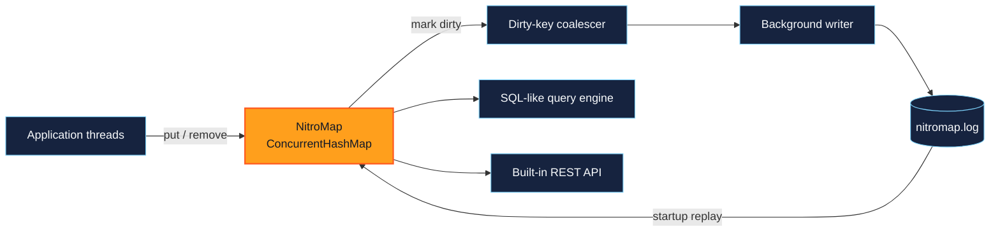

<p align="center">
  
</p>

<p align="center">
  
  
  
  
</p>

<p align="center">
  <a href="#why-nitromap">Why NitroMap</a> &bull;
  <a href="#quick-start">Quick start</a> &bull;
  <a href="#sql-like-queries">SQL</a> &bull;
  <a href="#rest-api">REST API</a> &bull;
  <a href="#performance-benchmarks">Benchmarks</a>
</p>

---

NitroMap is an embedded Java record store built around the API developers already
know: `ConcurrentHashMap`. Reads stay in memory, mutations are persisted by a
background writer, named maps can be queried with a practical SQL subset, and
the complete feature set can be exposed through Java's built-in HTTP server.

It is designed for applications that need fast local state without introducing
a database server, ORM, HTTP framework, or runtime dependency graph. The core
remains intentionally small, explicit, and understandable.

**Current status:** early-stage, fully test-driven, Java 17 compatible, and best
suited to embedded workloads where its documented consistency model is a good
fit.

## Why NitroMap

NitroMap combines three useful surfaces without hiding how any of them work:

| Surface | What it provides |
|---|---|
| Concurrent map | Familiar, thread-safe reads and writes on the in-memory hot path. |
| Persistent record store | Asynchronous batching, change coalescing, recovery, tombstones, and atomic compaction. |
| Queryable service | SQL-like joins and aggregation plus a built-in REST API with authorization and filter hooks. |

### Highlights

- Extends `ConcurrentHashMap` instead of replacing it with a proprietary API.
- Persists `put`, `putAll`, both `remove` variants, and `removeAll` asynchronously.
- Keeps serialization and file I/O away from application write threads.
- Replays a length-prefixed append-only log and safely discards a torn final record.
- Atomically compacts historical records into the current map state.
- Uses explicit application codecs rather than Java object serialization.
- Supports selection, joins, filtering, grouping, ordering, limits, and named parameters.
- Serves CRUD, batch, query, flush, compact, and health routes through built-in Java networking.
- Provides authorization and native HTTP filter hooks without an external web framework.
- Has no runtime dependencies beyond the JDK.
- Is verified by 120 correctness and integration tests plus five opt-in benchmark scenarios.

## Architecture



## How persistence works

A persistent mutation follows a short path:

1. The in-memory `ConcurrentHashMap` is updated.
2. The changed key is marked in a concurrent dirty map.
3. A single background writer collects dirty keys every few milliseconds.
4. It reads each key's current state and appends the batch to `nitromap.log`.
5. The log is forced to disk once for the batch.

Changing the same key several times before the writer sees it replaces the
pending marker instead of creating several disk writes. Serialization and file
I/O never run inside `put` or `remove`.

Values use length-prefixed key and value bytes. Removals use `-1` as a compact
tombstone marker:

```text
put:    [key length][key bytes][value length][value bytes]
remove: [key length][key bytes][-1]
```

On startup, NitroMap replays complete entries in order. If the process stopped in
the middle of the final entry, that incomplete tail is discarded before new
records are appended.

## Log compaction

The append-only design favors write speed, but old values and tombstones make
the log grow. `compact()` replaces that history with one value record for every
entry currently in the map:

```java
customers.compact();
```

Compaction writes the current state to `nitromap.log.compacting`, forces the new
file to disk, and atomically replaces `nitromap.log`. Until the atomic move, the
old log remains untouched. A process interruption therefore leaves either the
old complete log or the new complete log as the active file.

The background disk writer pauses during replacement, but `put` and `remove`
continue updating memory and marking keys dirty. Changes racing with the
snapshot are appended after compaction, so they are not lost.

Compaction is synchronous and manually triggered in this version. It is best
run when log growth justifies the temporary disk and serialization work, not on
every write.

## Quick start

Build and install the current snapshot locally with `mvn install`, then use the
following Maven coordinates:

```xml
<dependency>
    <groupId>dev.nitromap</groupId>
    <artifactId>nitromap</artifactId>
    <version>0.1.0-SNAPSHOT</version>
</dependency>
```

Create a persistent map with a directory and deterministic key/value codecs:

```java
import dev.nitromap.NitroMap;
import dev.nitromap.codec.Utf8StringCodec;

import java.nio.file.Path;
import java.util.Map;

Path directory = Path.of("data/customers");

try (NitroMap<String, String> customers = new NitroMap<>(
        directory,
        Utf8StringCodec.INSTANCE,
        Utf8StringCodec.INSTANCE)) {

    customers.put("customer-1", "Ada");
    customers.putAll(Map.of("customer-2", "Grace", "customer-3", "Linus"));
    customers.remove("customer-3");
}
```

Opening another map with the same directory and codecs restores those entries:

```java
try (NitroMap<String, String> customers = new NitroMap<>(
        directory,
        Utf8StringCodec.INSTANCE,
        Utf8StringCodec.INSTANCE)) {

    System.out.println(customers.get("customer-1")); // Ada
}
```

The writer persists those changes automatically. `flush()` is only needed when
the application requires a confirmed durability checkpoint while the map stays
open. `close()` stops the writer, performs a final flush, and closes the file.
Prefer try-with-resources so normal shutdown does not leave recent changes only
in memory.

## Codecs

Persistence works with bytes rather than assuming how application objects
should be serialized. A codec supplies both directions:

```java
public interface Codec<T> {
    byte[] encode(T value) throws IOException;
    T decode(byte[] bytes) throws IOException;
}
```

The project includes `Utf8StringCodec`. Applications can implement codecs for
records, JSON, Protocol Buffers, or any stable binary format. Key encoding must
remain deterministic: the same logical key should always produce the same
meaning when the log is replayed.

## SQL-like queries

The query engine operates entirely on the in-memory maps. It does not scan the
persistence log.

First, register maps as named tables and describe their visible columns:

```java
record Customer(String name, String city) {}

Schema<Customer> customerSchema = Schema.<Customer>builder()
        .column("name", Customer::name)
        .column("city", Customer::city)
        .build();

Catalog catalog = new Catalog()
        .add("customers", customers, customerSchema);

QueryEngine queries = new QueryEngine(catalog);
```

Schemas use explicit functions rather than reflecting over every value during a
query. The map key is automatically available through the special `_key`
column.

```java
QueryResult result = queries.query("""
        SELECT c.city, COUNT(*) AS customer_count
        FROM customers c
        WHERE c.city = :city OR c.name = :name
        GROUP BY c.city
        ORDER BY customer_count DESC
        LIMIT 10
        """, Map.of("city", "London", "name", "Ada"));

for (Map<String, Object> row : result.rows()) {
    System.out.println(row);
}
```

### Supported query subset

The current parser supports:

- `SELECT` with columns, aliases, `*`, and `COUNT(*)`.
- `FROM` with optional table aliases.
- One or more `INNER JOIN` clauses using column equality.
- `WHERE` with `=`, `!=`, `<>`, `>`, `>=`, `<`, and `<=`.
- `AND`, `OR`, and parenthesized conditions. `AND` has higher precedence.
- Strings, numbers, booleans, `NULL`, and named parameters such as `:minimum`.
- `GROUP BY` over one or more columns.
- `ORDER BY` with multiple `ASC` or `DESC` columns.
- `LIMIT`, including `LIMIT 0`.

A join against the newly joined table's `_key` performs direct map lookups.
Other equality joins build a temporary hash index. NitroMap never uses a nested
loop join.

Parsed queries are cached by SQL text, so repeated parameterized queries do not
need to be parsed again.

## REST API

NitroMap includes a small server built on Java's `HttpServer`. It uses the same
codecs as persistence, so single-entry and batch requests stay binary and avoid
an extra serialization layer on the hot path.

```java
import dev.nitromap.http.NitroMapHttpServer;

NitroMapHttpServer<String, String> server = NitroMapHttpServer
        .builder(customers, Utf8StringCodec.INSTANCE, Utf8StringCodec.INSTANCE)
        .port(8080)
        .queries(queries)
        .authorize(exchange -> "secret".equals(
                exchange.getRequestHeaders().getFirst("X-Api-Key")))
        .build()
        .start();
```

The server and map have separate lifecycles. Closing the server stops accepting
HTTP requests; closing the map flushes and closes persistence. Applications can
keep both as fields and close them during normal application shutdown.

### Endpoints

| Method | Path | Purpose |
|---|---|---|
| `GET` | `/health` | Return server status and current map size. |
| `GET` | `/entries/{key}` | Read one value. |
| `PUT` | `/entries/{key}` | Put one value. |
| `DELETE` | `/entries/{key}` | Remove one value. |
| `PUT` | `/entries` | Put a binary batch. |
| `DELETE` | `/entries` | Remove a binary batch of keys. |
| `POST` | `/query` | Execute a SQL-like query. |
| `POST` | `/flush` | Wait until pending mutations are durable. |
| `POST` | `/compact` | Compact the persistence log. |

Entry keys are URL-safe Base64 encodings of the key codec bytes. Use
`server.entryPath(key)` to construct the correct path. A single `PUT` body and
`GET` response contain the raw value codec bytes with content type
`application/octet-stream`.

Batch operations use four-byte, big-endian lengths followed by codec bytes:

```text
PUT /entries:    [key length][key][value length][value] ...
DELETE /entries: [key length][key] ...
```

`BinaryBatchCodec` encodes and decodes these request bodies without requiring a
JSON library:

```java
BinaryBatchCodec<String, String> batches = new BinaryBatchCodec<>(
        Utf8StringCodec.INSTANCE, Utf8StringCodec.INSTANCE);

byte[] body = batches.encodeEntries(Map.of("customer-1", "Ada"));
```

For `/query`, send the SQL text as a UTF-8 request body. Named parameters come
from URL query parameters:

```text
POST /query?city=London

SELECT c.name FROM customers c WHERE c.city = :city ORDER BY c.name
```

The response is JSON in the form `{"rows":[...]}`. Query parameters recognize
`null`, booleans, integers, and decimal numbers; other values remain strings.
Configure a `QueryEngine` with `.queries(queries)` to enable this endpoint.

The authorization hook runs before every route. It defaults to allow-all, so a
network-facing deployment should supply `.authorize(...)`. Native Java HTTP
filters can handle logging, request IDs, rate limiting, or broader middleware:

```java
server.addFilter(myFilter);
```

This server intentionally stays small: it has no external HTTP or JSON
dependency and limits request bodies to 64 MiB. It does not configure TLS. Bind
to a trusted interface, place it behind a TLS proxy, or add an `HttpsServer`
integration before exposing it to an untrusted network.

## Where NitroMap fits

NitroMap is a strong fit for fast local indexes, embedded metadata stores,
desktop and edge applications, durable service caches, developer tools, and
small services that benefit from map semantics with optional SQL and HTTP
access. It is particularly useful when operational simplicity and predictable
local performance matter more than distributed transactions.

It is not intended to replace a distributed database, a transactional ledger,
or a multi-process storage engine. The boundaries below make that distinction
explicit.

## Performance benchmarks

Benchmarks live in a separate Maven profile so ordinary correctness tests stay
fast and deterministic:

```shell
mvn -Pbenchmark test
```

The harness performs two warm-up runs and reports the median of five measured
runs. It uses no speed assertions: CI machines can run it without failing due
to noisy neighbours or slower hardware.

### Reference run

Measured on Mac OS X/aarch64 with 10 available processors and the Java 25
runtime, while compiling NitroMap for Java 17. Results are directional and will
vary with the JVM, CPU, filesystem, thermal state, data shape, and contention.

| Scenario | Median throughput | Median cost |
|---|---:|---:|
| In-memory `get` | 279.4 million ops/s | 3.6 ns/op |
| In-memory `put` | 124.2 million ops/s | 8.1 ns/op |
| Persistent `put` enqueue | 68.3 million ops/s | 14.6 ns/op |
| Persistent `put` plus durability checkpoint | 3.89 million ops/s | 257.1 ns/op |
| Compacted log replay | 441,730 records/s | 2,263.8 ns/record |
| Cached SQL query | 1,794 queries/s | 557.3 µs/query |

The map benchmarks rotate through 65,536 hot keys on one application thread.
The persistence scenario performs 500,000 updates while the background writer
is active; the durability figure includes the final `flush()`. Replay loads
50,000 compacted records. The query scenario scans 10,000 rows, filters roughly
half, orders the result, and applies `LIMIT 100` using an already-cached parse
plan.

These are lightweight project benchmarks rather than a substitute for JMH or
an application-specific load test. Run the profile on target hardware before
using the numbers for capacity planning or latency commitments.

## Design principles

NitroMap follows a few practical rules:

### Keep the write path short

`put` and `remove` update memory and mark a key dirty. Encoding, batching, disk
writes, and disk synchronization belong to the background writer.

### Prefer sequential I/O

Changes are appended to one log instead of creating and renaming a file for
every key. This reduces random I/O and filesystem metadata work.

### Persist state, not every intermediate event

If a key changes repeatedly before a batch is written, NitroMap persists the
latest pending state. It is a persistent map, not an event-stream archive.

### Make serialization explicit

The application chooses codecs. This keeps the storage format intentional and
avoids the compatibility and security problems of implicit Java object
serialization.

### Keep storage and querying separate

Persistence owns durability and recovery. The query package works with the live
in-memory maps. Neither layer needs to understand the other's implementation.

### Be honest about consistency

Queries are weakly consistent with concurrent writes, matching
`ConcurrentHashMap` iteration semantics. NitroMap does not pause writers or copy
the entire map to create a transactional snapshot.

## Scope and current boundaries

NitroMap is an early-stage embedded engine, not a transactional database. Its
current boundaries are deliberate:

- Direct `put`, `putAll`, both `remove` overloads, and `removeAll` are persisted.
  Other inherited mutations—including `replace`, `compute`, `merge`, and
  changes through collection views—currently affect memory without writing the
  log.
- Values should be treated as immutable. Mutating an object returned by `get`
  does not mark its key dirty; replace it with another `put` instead.
- Recent asynchronous mutations can be lost if the process terminates before
  the next batch reaches disk. Call `flush()` when a durability boundary is
  required.
- Compaction is manual; there is no automatic size or stale-record threshold
  yet.
- A persistence directory should be opened by only one NitroMap instance at a
  time. Cross-process file locking is not implemented yet.
- Queries are not transactional and may observe concurrent changes.
- Aggregation currently supports `COUNT(*)` only.
- Joins are inner equality joins; outer joins and arbitrary join expressions are
  not supported.

Keeping these guarantees explicit lets the implementation stay compact and
makes it clear where future capabilities can be added without compromising the
fast common path.

## Building and testing

Run the 120 correctness and integration tests:

```shell
mvn test
```

Compile, test, and package the JAR:

```shell
mvn verify
```

Install the current snapshot into your local Maven repository:

```shell
mvn install
```

Run only the five opt-in performance scenarios:

```shell
mvn -Pbenchmark test
```

The correctness suite covers map semantics, persisted writes and removals,
restart recovery, torn and invalid records, background-writer failures,
compaction failures and races, concurrency, codecs, SQL parsing and execution,
join strategies, grouping, ordering, validation, binary HTTP batches,
authorization, filters, JSON encoding, and live REST requests against a
temporary local server.

## Project layout

```text
assets/
└── nitromap-logo.svg        project wordmark and README banner

src/main/java/dev/nitromap/
├── NitroMap.java             concurrent map and public persistence API
├── codec/                   binary encoding contracts and codecs
├── http/                    REST server, routing, hooks, and wire formats
├── persistence/             batching, append-only logging, and recovery
└── query/                   schemas, SQL parsing, planning, and execution

src/test/java/dev/nitromap/
├── benchmark/               opt-in median-sample performance scenarios
└── ...                      focused unit and integration tests
```

NitroMap's direction is straightforward: keep the common path fast, make
durability explicit, and add database-like capabilities only when they remain
small enough to understand, measure, and trust.
